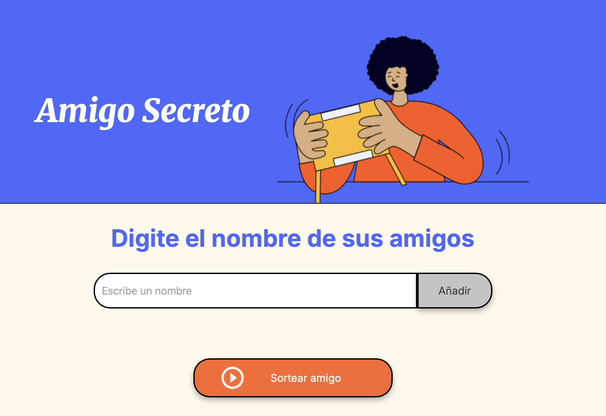

# Proyecto Amigo Secreto

Este es un proyecto simple en **JavaScript** que permite:

- Agregar amigos a una lista.
- Mostrar los amigos en pantalla.
- Realizar un sorteo aleatorio para elegir un amigo.

##  ¿Cómo usarlo?

1. Escribe un nombre en la caja de texto.  
2. Haz clic en **Agregar** para añadirlo a la lista.  
3. Cuando tengas todos los nombres, presiona **Sortear Amigo** para elegir uno al azar.  

## 📂 Tecnologías usadas

- **HTML5** para la estructura.
- **CSS3** para estilos básicos.
- **JavaScript** para la lógica del listado y sorteo.

Desarrollado por Jean Chavez